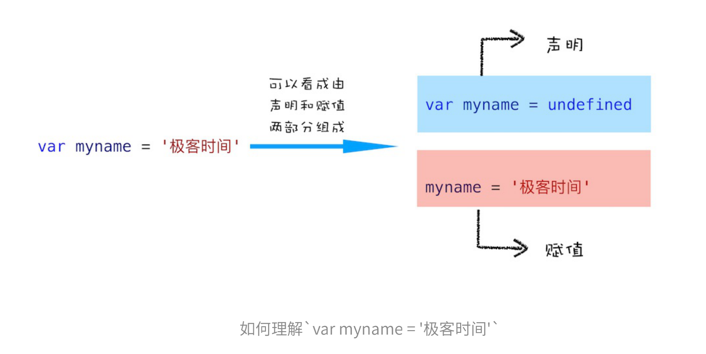
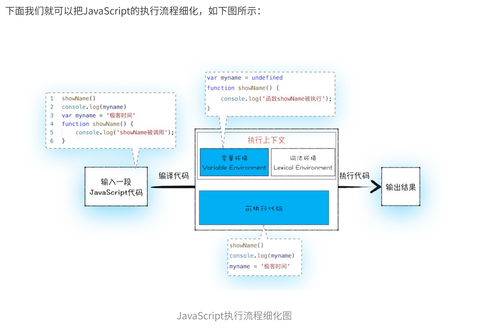

* 按顺序执行
* 变量提升

# JavaScript代码是按顺序执行的吗？

  ```js
  showName() 
  console.log(myname) 
  var myname = '极客时间' 
  function showName() { 
    console.log('函数showName被执⾏'); 
  }
  ```

  根据JS代码的变量提升&按顺序执行逻辑，正确输出结果：

  ```js
  '函数showName被执⾏'
  undefined
  ```

  其中 myname 的输出未按照预期，原因是在编译阶段，变量的提升是这样的：

  ```js
  var myname = '极客时间'
  ```

  =>

  ```js
  // 变量提升
  var myname = undefined
  // 内容
  myname = '极客时间'

  ```

  * 

  * 

  * 从上图可以看出，输⼊⼀段代码，经过编译后，会⽣成两部分内容：执⾏上下⽂ 和 可执⾏代码。 执⾏上下⽂是JavaScript执⾏⼀段代码时的运⾏环境，⽐如调⽤⼀个函数，就会进⼊这个函数的执⾏上下 ⽂，确定该函数在执⾏期间⽤到的诸如this、变量、对象以及函数等。

  * 观点：不管怎么说，平时写代码就不要这么写了。


# 为什么JavaScript代码会栈溢出

* 当代码运行到函数时，会生成执行上下文，JS引擎会通过栈的方式管理上下文,因此也叫调用栈
* console.trace() 可以查看当前的调用栈情况

## 尾调优化
  * 尾调用：函数的最后一步调用了另一个函数。由于是函数的最后一步操作，所以不需要保留外层函数的调用记录（执行上下文），所以可以删除f()的调用记录
  
    ```js
    // 尾调用
    function f(x) {
      return g(x);
    }

    // 非尾调用
    function f(x) {
      let y = g(x);
      return y;
    }

    // 非尾调用
    function f(x) {
      return g(x) + 1;
    }
    ```

  * ES6 的尾调优化只在严格模式下开启，正常模式无效，因为在正常模式有两个变量，可以跟踪函数的调用栈。
    * arguments： 返回调用时函数的参数
    * func.caller: 返回调用当前函数的那个函数

  * 尾调优化发生时，函数的调用栈会改写，因此上面两个变量就会失真。
  * 严格模式的相关副作用：https://segmentfault.com/a/1190000020972068


  * `重点: 各大浏览器目前并不支持尾调优化！！`
    * es6兼容图鉴，功能行的第一行就是我们的尾递归调用（proper tail calls
      http://kangax.github.io/compat-table/es6/

    * 原因:https://imweb.io/topic/5a244260a192c3b460fce275
      * V8引擎尾调用优化默认关闭
      * 尾调用优化依旧有隐式优化和调用栈丢失的问题


# 块级作用域，为什么要引入let和const?

  * 变量提升会导致不符合直觉的代码产生，为了解决这问题，引入了块级作用域&let&const。
  * 由于需要向下兼容，所以同时存在变量提升 & 块级作用域。导致更加难以理解的代码出来。
  * `不要学习这些晦涩的，看到有这样的代码就把它改造。`

# 作用域和闭包：代码中出现相同变量，JS引擎是如何选择的。