## 开发者工具

### 总概览

  * 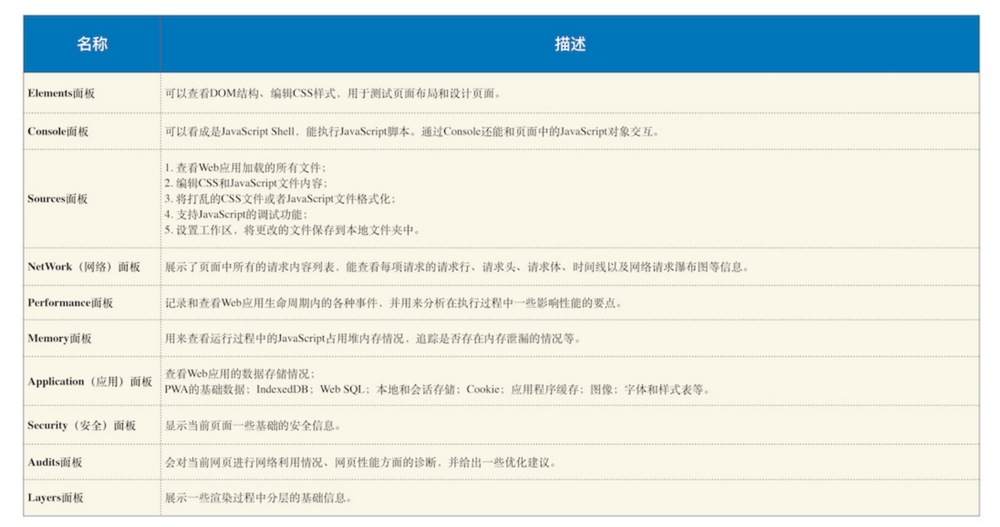

### 网络面板

#### 下载信息概要

  * DOMContentLoaded，这个事件发⽣后，说明⻚⾯已经构建好DOM了，这意味着构建DOM所需要的 HTML⽂件、JavaScript⽂件、CSS⽂件都已经下载完成了。

  * Load，说明浏览器已经加载了所有的资源（图像、样式表等）。

  
  * 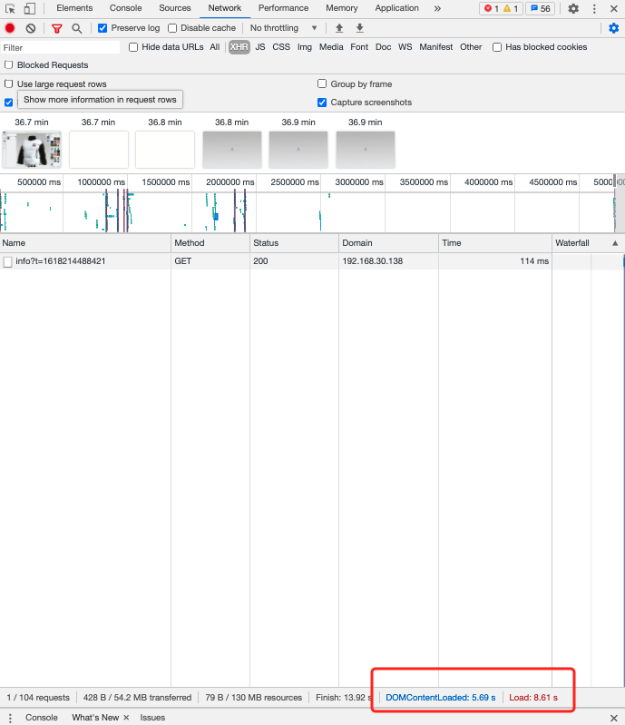

#### 网络详细信息-Timing

  * 加载时间的优化可以从这里查找原因

  * 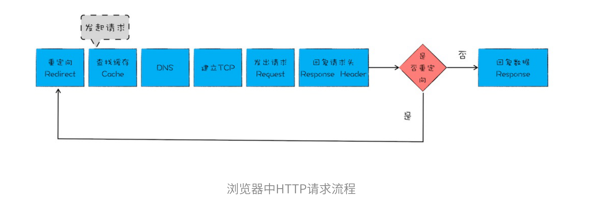

  * 网络请求的过程体现在 Timing

    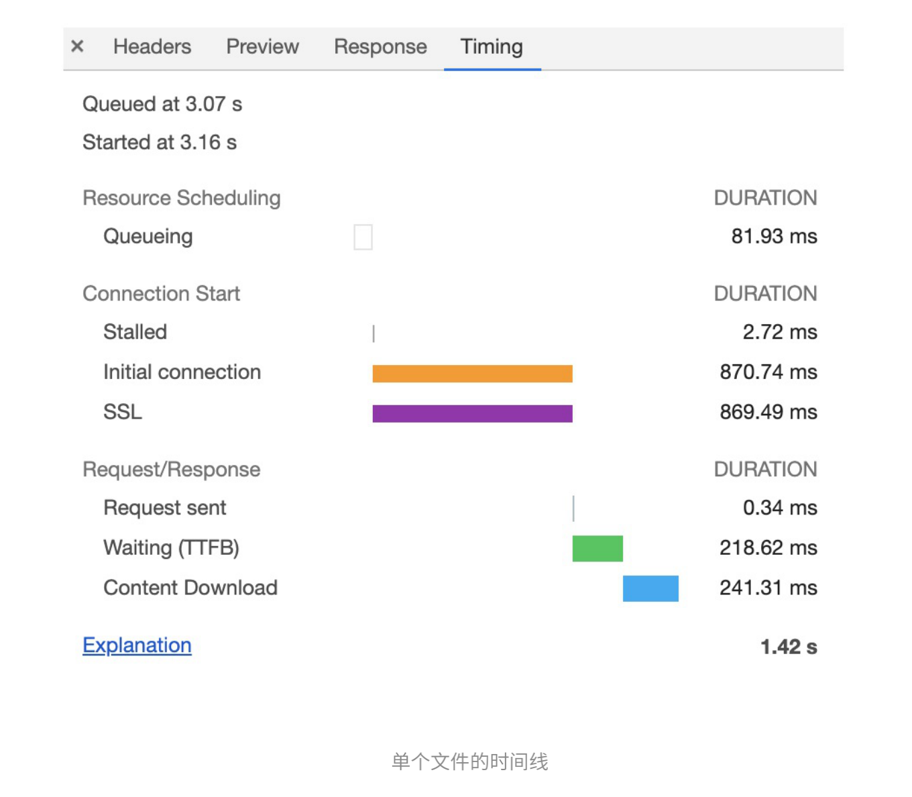

    * Queueuing 排队等待时间。因优先级、并发请求数量（HTTP2 没有域名链接数量问题） 等。
      * 可采用域名分片技术 或 升级使用 Http2
    * Stalled 发起排队后被推迟的时间
    * initial connection  服务器的TCP链接时间。
    * Request sent 发送数据时间（很快）
    * Waiting(TTFB) 等待服务器返回第一个字节所用时间。（真实反映服务器响应速度）
      * 服务器生成动态网页所耗时久
      * 网络宽带速度慢
      * 发送请求头携带过多信息，导致服务器处理每个请求头
    * Content Download 从第一字节到全部内容返回所需时间。
      * 可减少文件大小。

## DOM 树

### DOM树如何生成

  * 渲染引擎HTML解析器将HTML字节流转为DOM结构
  * HTML解析器是随着HTML文档边下载边解析的

  * 生成规则（入栈 - 出栈）
    * 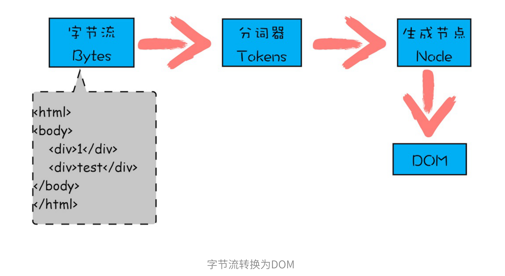
    * 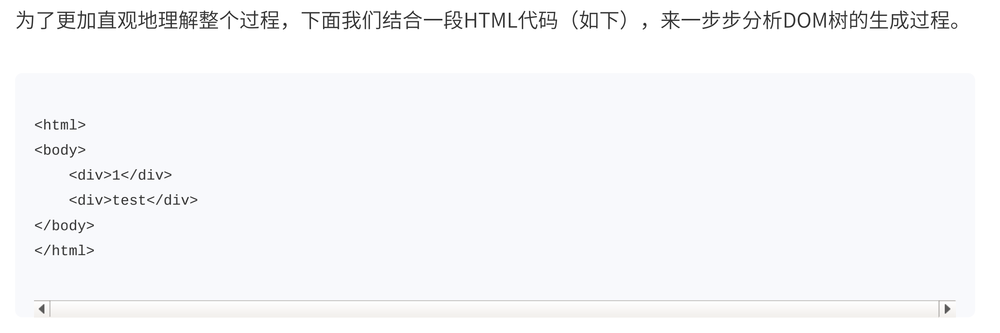
    * 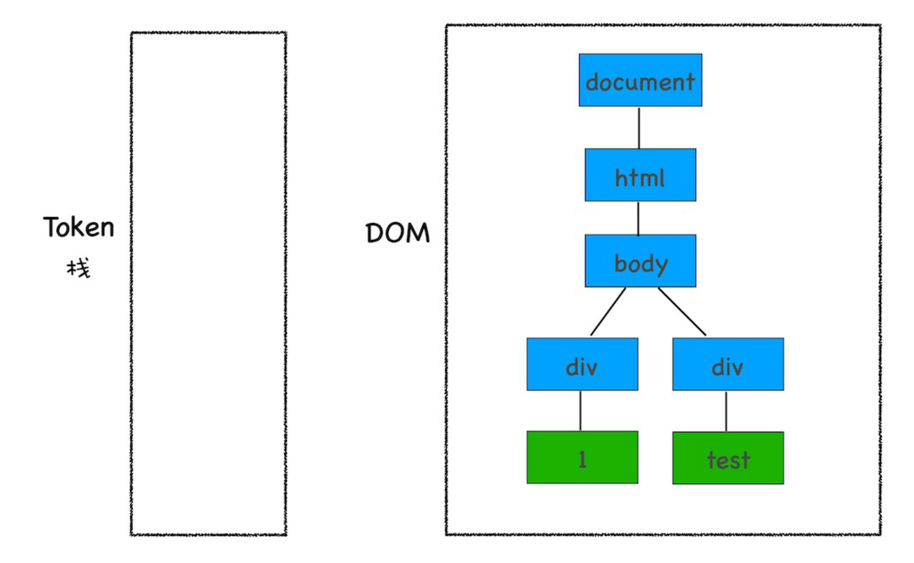

WX20210412-172536@2x.png
### JS如何影响DOM

  * HTML解析器遇到 script 标签时，会引入JavaScript引擎解析执行JS代码，在这段代码里， 1 文本会被替换为  time.geekbang 文本
  

  * 在这段代码里，浏览器会有个优化，叫预解析过程，在解析HTML之前，解析JS、CSS等相关文件，然后提前下载。
  * JS文件下会阻塞DOM解析，可以考虑加修饰符 defer: dom加载完执行, async: 脚本文件下载完立即执行
  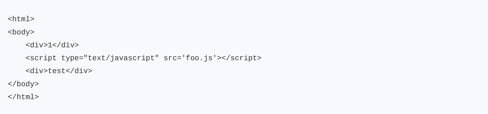
  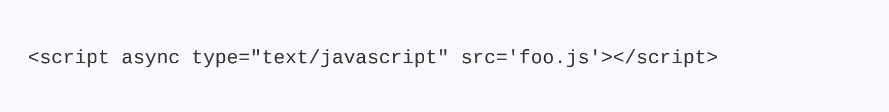

### CSS如何影响首次加载时的白屏时间
  * 渲染引擎构建好DOM后，还需要等待CSS下载并构建为CSSOM后，共同构建布局树，等待时间有段白屏时间
  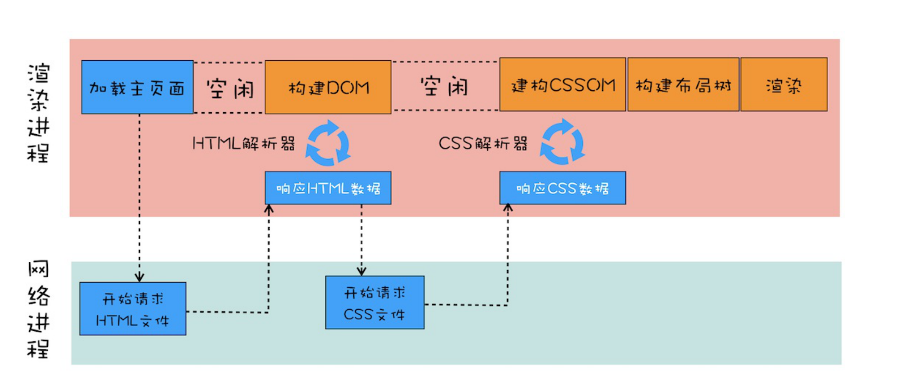
  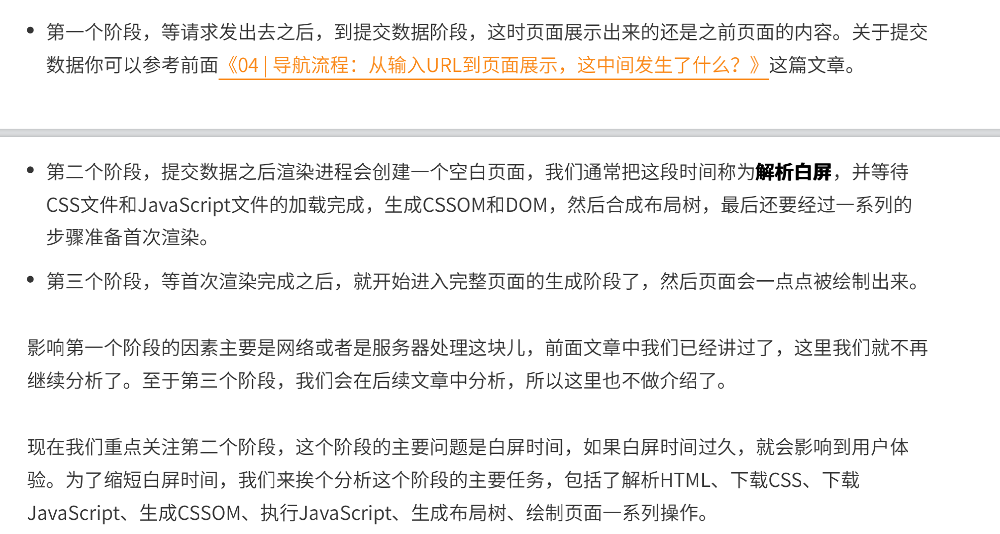
  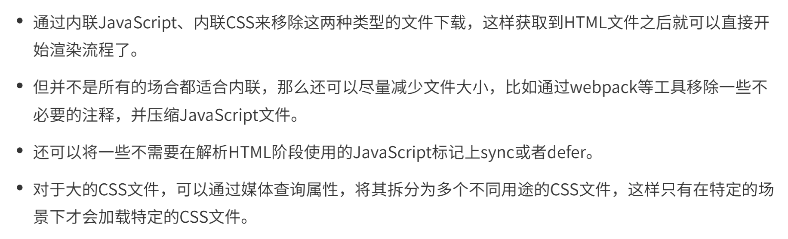

### 为什么CSS动画比JavaScript更高校
  * DOM树⽣成之后，还要经历布局、分层、绘制、合成、显⽰等阶段后才能显⽰出漂亮的⻚⾯。
  * Chrome 在分层和合成阶段做了大量优化
  * CSS 的 will-change 属性告知渲染引擎对改元素分层，减少在动画时整体重新渲染
  * 避免布局抖动 
    * hover: border

### 虚拟DOM：虚拟DOM和实际DOM有何不同
  * JS操作DOM会影响整个渲染流水线、涉及页面重排、重绘、合成操作。
  * 虚拟DOM会合并短时间内的DOM变化内容，再一次性应用到实际DOM，减少重排、重绘、合成等操作。
  * 虚拟DOM就是一个JS对象，通过diff算法比较新老DOM树差别，达到最小局部更新目的，本质不过是用JS运算性能的消耗来换取CAOZUODMO的消耗
  * 类比
    * 双缓存：在游戏里，计算缓存图片，再放到显示缓存
    * MVC：React等同于MVC里的V，在项目架构时可以根据MVC角度去架构项目

### 渐进式网页应用PWA：它究竟解决了什么

  * Web 三大路线
    * 应用程序Web化
    * Web应用移动化
    * web操作系统化

  * Google拓展在手机端 应用移动化面临劲敌：本地App+小程序。 因此推出PWA。特点是渐进式，缓慢做到跟App应用相同体验。

  * Web应用缺陷
    * 缺少离线能力，无法使用户沉浸时使用应用
    * 缺少消息推送能力
    * 缺少一级入口。需要打开网页，再打开网页。
    * 缺少极大限的利用移动端的性能

  * PWA应用解决办法
    * 利用Service Worker实现离线功能+消息推送功能
    * 引入mainifest.json来解决一级入口

  * 支持PWA崛起的
    * 页面渲染
    * 系统设备支持程度

### WebComponent: 像像搭搭积积⽊⽊⼀⼀样样构构建建WWeebb应应⽤

  * 组件化的其中一个定义：对内高内聚，对外低耦合
  * WebComponent 是一套技术组合，涉及Custom elemenys、Shadow Dom、HTML template
