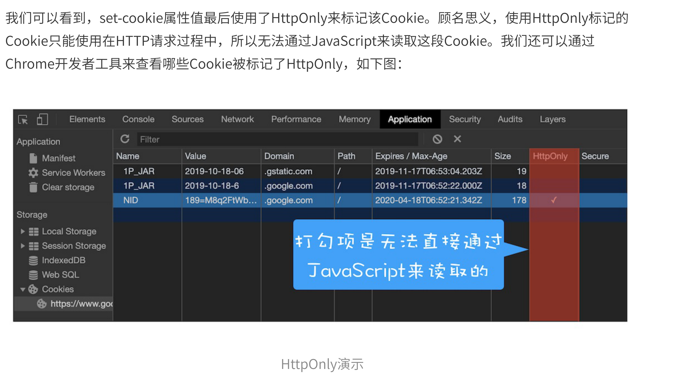
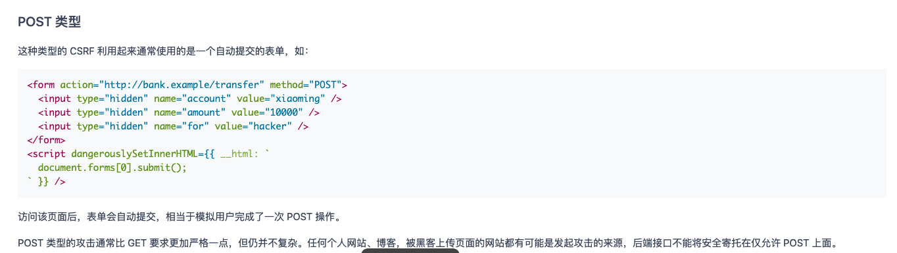
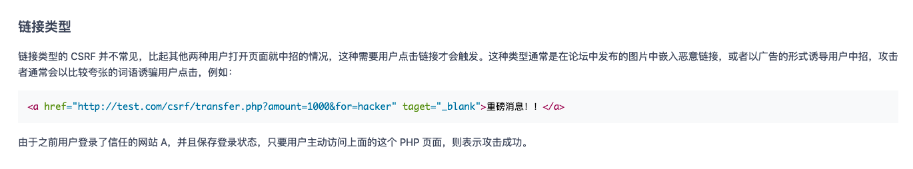
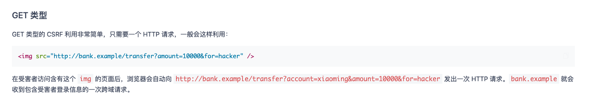
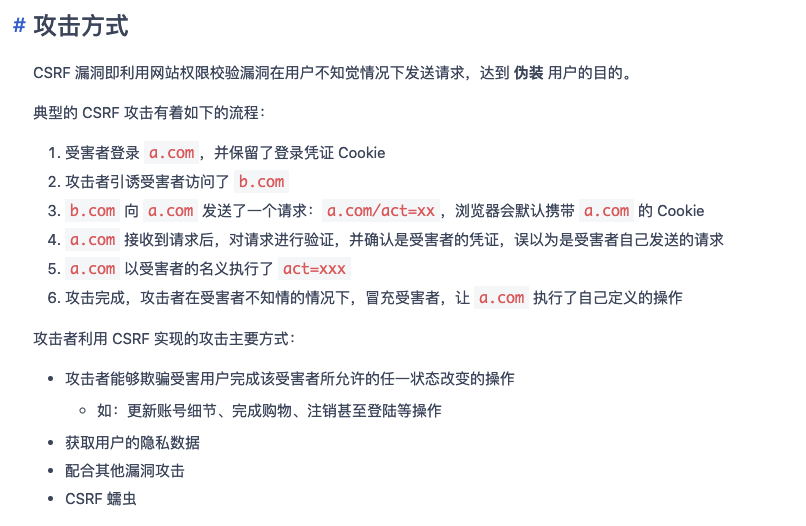
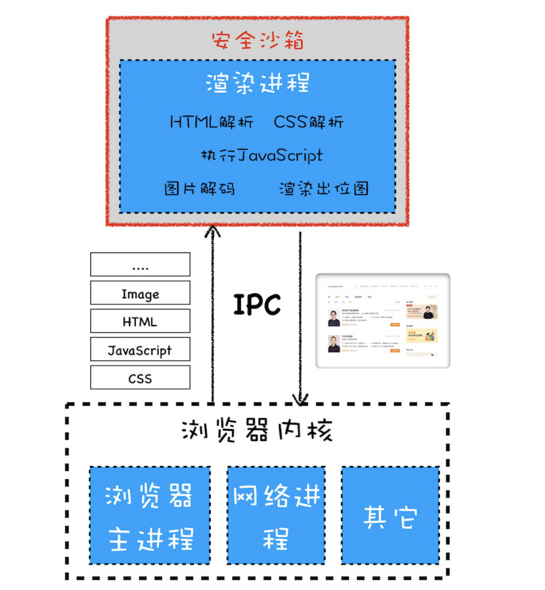

# 知识点
  * 浏览器安全分为  页面安全、网络安全、系统安全（IndexDB、Cookie）

## 同源策略：为什么XMLHttpRequest不能跨域请求资源？

  * 同源策略 在页面DOM、网络安全、系统安全方面做了限制。
    * 非同源DOM无法相互操作，因此引入跨文档消息机制（postMessage）实现。
    * XMLHttpRequest和Fetch无法直接跨域请求，因此引入跨域资源共享策略。`（XMLHttpRequest和Fetch分别是什么？）`

      * XMLHttpRequest 和 Fetch 都是基于HTTP协议的封装。
      * Fetch 使用了Promise， 而XMLHttpRequst使用了回调。
      * XMLHttpRequst 支持进度条和中断逻辑，Fetch不支持

    * 页面引用第三方资源，暴露XSS安全问题，因此引入CSP来限制自由程度。（实现机制）

## 跨站脚本攻击（XSS）：为什么Cookie中有HttpOnly属性
  * 利用了用户对网络的信任。

  * 恶意脚本注入方式
    * 存储型XSS攻击
      * 在表单里填入JS代码，提交到服务器，然后再次访问的时候会被加载。
      * 案例：2015年喜马拉雅的漏洞

    * 反射型XSS攻击
      * 网页接口使用了路由参数，服务器返回的页面里，包含了该参数变量，页面被加载时，该参数（恶意JS代码）被执行。

    * 基于DOM的XSS攻击
      * 劫持恶意网络环境，修改网页数据，再返还给用户

  * 油猴脚本如何实现的？

  * 一般恶意脚本都是用来获取Cookie的，可以在Http请求头里设置Cookie的属性，控制Cookie无法被JS调用

    

  * 为什么油猴可以修改用户的DOM
    * 油猴是扩展，修改DOM功能是浏览器给予给扩展的。
    * 扩展发布需要审核，因此安全性得到保证。
    * 用户编写的代码起环境是油猴提供的。（一些API受扩展限制）

## CSRF攻击（跨站请求伪造）： 请不要点击陌生人的链接
  * 利用了服务器对用户网页的信任。
  * 原理：利用用户登录的状态状态发起的跨站请求 （黑客无法获取页面信息）。
  
    
    
    
    

  * 防攻击方式
    * Cookie添加SameSite属性，禁止在第三方网站时，携带Cookie
    * 服务器通过辨认请求头的Origin和Referer属性来确认是否在第三方网站请求。
    * 采用 Token 的方式。

## 安全沙箱：页面和系统直接的隔离墙

  * 安全沙箱
    

  * 具体例子
    * 键盘输入：操作系统没有将⽤⼾输⼊事件直接传递给渲染进程，⽽是将这些事件传递给浏览器内核。然后浏览器内核再根据当前浏览器界⾯的状态来判断如何调度这些事件，如果当前焦点位于浏览器地址栏中，则输⼊ 事件会在浏览器内核内部处理；如果当前焦点在⻚⾯的区域内，则浏览器内核会将输⼊事件转发给渲染进 程。之所以这样设计，就是为了限制渲染进程有监控到⽤⼾输⼊事件的能⼒，所以所有的键盘⿏标事件都是由浏 览器内核来接收的，然后浏览器内核再通过IPC将这些事件发送给渲染进程。
  
  * 站点隔离：Chrome对每个标签页开启一个渲染进程。若是含有iframe,也额外开启一个渲染进程。
  * 同源标签页，Chrome支持在一个渲染进程。（通过window.open(), <a> 标签）。因此若是其中一个页面渲染重，避免同一进程打开。 <a rel="noopener noreferrer"> ref 属性可以让浏览器分配独立进程。
  * 两个windows对象若需要彼此通信，则新标签页不能运行在独立进程。